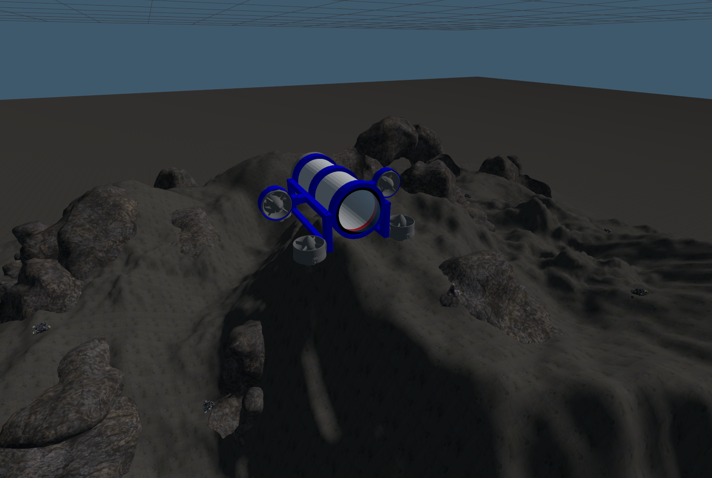

# Underwater UUV Simulation in Gazebo Sim

This project provides a custom **Unmanned Underwater Vehicle (UUV) simulation** in **Gazebo Sim (v8.9)** with an underwater world environment.  
The world includes a scaled **OceanFloorShipwreck** model and a custom-built `uuv_model` robot.

The simulation uses Gazebo's **buoyancy** and **hydrodynamic drag plugins** to emulate underwater physics.



---

## Project Structure

```
my_uuv_gz
├─ README.md
├─ models
│  ├─ OceanFloorShipwreck
│  │  ├─ materials
│  │  │  ├─ scripts
│  │  │  │  └─ model.material
│  │  │  └─ textures
│  │  │     ├─ Coral02_Albedo.png
│  │  │     ├─ Coral02_Normal.png
│  │  │     ├─ Coral02_Roughness.png
│  │  │     ├─ Coral03_Albedo.png
│  │  │     ├─ Coral03_Normal.png
│  │  │     ├─ Coral03_Roughness.png
│  │  │     ├─ GroundSand_Albedo.png
│  │  │     ├─ GroundSand_Roughness.jpg
│  │  │     ├─ GroundSant_Normal.png
│  │  │     ├─ Rock_Albedo.png
│  │  │     ├─ Rock_Normal.png
│  │  │     ├─ Rock_Roughness.png
│  │  │     ├─ SunkenShip_Albedo.png
│  │  │     ├─ SunkenShip_Metalness.png
│  │  │     ├─ SunkenShip_Normal.png
│  │  │     └─ SunkenShip_Roughness.png
│  │  ├─ meshes
│  │  │  └─ underwaterworld.dae
│  │  ├─ model.config
│  │  ├─ model.sdf
│  │  └─ thumbnails
│  │     ├─ 1.png
│  │     ├─ 2.png
│  │     └─ 3.png
│  └─ uuv_model
│     ├─ meshes
│     │  ├─ capsule_back_cover.stl
│     │  ├─ capsule_cylinder.stl
│     │  ├─ capsule_front_guard.stl
│     │  ├─ capsule_glass.stl
│     │  ├─ capsule_seal.stl
│     │  ├─ frame_lower.stl
│     │  ├─ frame_upper.stl
│     │  ├─ thruster2.stl
│     │  ├─ thruster3.stl
│     │  ├─ thruster5.stl
│     │  ├─ thruster6.stl
│     │  ├─ thruster7.stl
│     │  └─ thruster8.stl
│     ├─ model.config
│     ├─ model.sdf
│     └─ trash.sdf
└─ worlds
   ├─ previous.sdf
   └─ underwater_world.sdf
```

---

## OceanFloorShipwreck Model

The **OceanFloorShipwreck** model is not included by default.  
You need to download it from **Ignition Fuel (Gazebo Fuel)**:

https://app.gazebosim.org/OpenRobotics/fuel/models/OceanFloorShipwreck

After downloading, place it in:

```
my_uuv_gz/models/OceanFloorShipwreck
```

so that the folder matches the structure above.

---

## Installation

1. Install ROS 2 Jazzy (if not already installed)  
   Follow the official ROS 2 Jazzy installation guide:  
   https://docs.ros.org/en/jazzy/Installation.html

2. Install Gazebo Sim (v8.9)

```bash
sudo apt update
sudo apt install gz-sim8 ros-jazzy-gz-ros2-control
```

3. Install additional dependencies

```bash
sudo apt install ros-jazzy-ros-gz
sudo apt install ros-jazzy-gz-sim
```

4. Clone the Repository

```bash
git clone https://github.com/<your-username>/my_uuv_gz.git
cd my_uuv_gz
```

5. Set up environment variables

Add the models folder to Gazebo’s search path in your `~/.bashrc`:

```bash
export GZ_SIM_RESOURCE_PATH=$HOME/my_uuv_gz/models:$GZ_SIM_RESOURCE_PATH
```

Then reload:

```bash
source ~/.bashrc
```

---

## Running the Simulation

From your home directory:

```bash
gz sim ~/my_uuv_gz/worlds/underwater_world.sdf
```

This will:

- Load the underwater environment with scaled OceanFloorShipwreck  
- Spawn the UUV model at 1m depth  
- Apply buoyancy and hydrodynamic drag plugins for realistic underwater motion  

---

## Features

- Custom underwater world with ambient lighting and fog  
- Scaled OceanFloorShipwreck environment  
- Modular UUV model with STL meshes  
- Hydrodynamic drag and buoyancy physics plugins  
- Directional lighting for underwater visualization  

---

## Notes

- If you see errors like `Unable to find uri[model://...]`, double-check your `GZ_SIM_RESOURCE_PATH`.  
- If Gazebo shows a white screen, try forcing the render engine:

```bash
gz sim --render-engine ogre2 ~/my_uuv_gz/worlds/underwater_world.sdf
```

---


